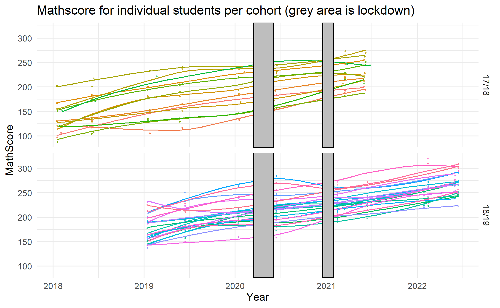

# Florian van Leeuwen

_Data Driven Researcher based in the Netherlands, currently working on the estimation of the Covid lockdown on math scores of students:  

  

[Email](mailto:floriandammesvanleeuwen@gmail.com) | [LinkedIn](https://www.linkedin.com/in/f-van-leeuwen/) | [GitHub](https://github.com/Fdvanleeuwen/)

Link to my CV in a [pdf](CV_Florian_van_Leeuwen.pdf)  

## 👩🏼‍💻 Experience

**Researcher** @ [SEO Amsterdam Economics](https://www.seo.nl/en/) _(Jan 2020 - Present)_  
SEO Amsterdam Economics conducts applied economic research on behalf of both public and private sector clients. Our research is fully independent, thus helping our clients to take the right decisions
  - Lead analyst in a lab experiment on executive compensation to nudge CEOs into clean investments
  - Daily workload meetings with stakeholders, data cleaning/analysis, writing reports and presenting results.
  - **_Technologies used:_** R, Python, Stata
  

**Statistical (Thesis) Intern** @ [CITO](https://www.cito.com) _(Aug 2022 - Present)_  
  - Conducting a simulation study to assess suitable methods to estimate causal effects in time-series settings with a low number of time points
  

**Student-assistent** @ [Utrecht University](https://www.uu.nl/en) _(Dec 2022 - Present)_  
Supporting research into the depression of adolescence
 - Building a module to make multilevel models for longitudinal data analysis accessible for researchers at the UU.

**Poker Player**  _(2017 -  2020)_  
Played poker professionally all over the world. 
  - Used probability calculations to maximize the expected value of each decision, which resulted in a long-term winning strategy
  - In the top 0.5% of tournament players for the years 2019 and 2020
  - Played in live tournaments in London, Barcelona, Melbourne, and more
    

## 👩🏼‍🎓 Education
**(Research) Master - Statistics** @ [Utrecht University] _(Aug 2021 - Present)_ 
A two year master's program specializing in applied statistics, running GPA: 8
  - Courses - Supervised Learning, Causal Inference, Multilevel Modelling, Bayesian Statistics
  - Completed the Graduate Honours Interdisciplinary Seminars Program
  - Project on predicting if mushrooms are poisonous can be found [here](https://github.com/Fdvanleeuwen/Getting-High-or-Die)
  - Project on forecasting energy prices can be found [here](https://github.com/Fdvanleeuwen/Energy-Price-Forecasting) 
    

**Exchange** @ [National University of Singapore (NUS)] _(Jan 2023 - Present)_  
On exchange for one semester at the #1 ranked university in Asia
  - Courses: - Optimisation for Large-Scale Data-Driven Inference, Statistical Learning II, Programming Methodology in C
    

**Bachelor of Science - Natural and Social Science** @ [University of Amsterdam] _(2018 - 2021)_ 
Major in Economic
  - Thesis On Students' Borrowing Behaviour in the Netherlands was awarded a 9.5, the highest grade in the economics cohort.
    

**Online courses**  
  - Coursera: Machine learning specialization from Stanford University and DeepLearning.AI
  - Kaggle: Intro to Machine Learning, Intermediate Machine Learning, Time Series Analysis
    
  

## 🎤 Public Speaking

- **IRT workshop** Enschede _( 24 nov, 2022)_
 [Presentation about the estimation of causal effects with few time points] 

- **Misitery of Eduction (Student loan department)** _(22 September, 2021)_
 [Presentation about the findings of my bachlor's thesis] 
 
  
## 💬 Languages

🇳🇱 **Dutch**: Native 
🇺🇸 **English**: C2  
💻 **Programming**:  R, Python, SQL, STATA, C
  
